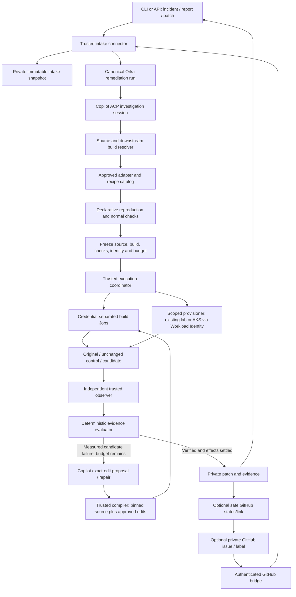
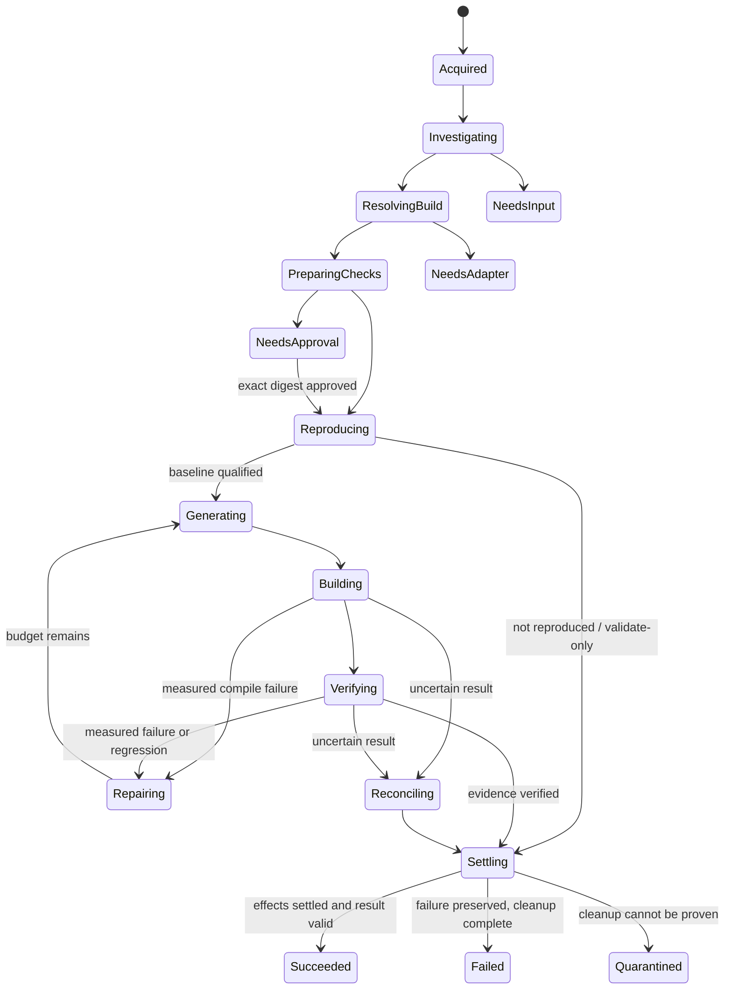

# Autonomous report remediation: architecture and delivery plan

Status: **the scoped local POC is qualified end to end; broader delivery work
remains**. Qualification update: **2026-10-06**. Source baseline: HEAD
`55cb3d5232b4a9b697e72471e346c0a6493d4c21` plus the uncommitted worktree.
This document contains no incident payloads, private patches, deployment
credentials, or host-specific replay instructions.

Design review: Opus 5.5 with maximum reasoning and long context reviewed two
drafts. The follow-up approved the direction and marked all four high-priority
and eight medium architecture findings resolved. Its remaining documentation
requirements are incorporated into the milestones, backend choice and
verification matrix below. That architecture review was separate from the
scoped source reviews and live qualification described below.

## Local qualification update

The supported, operator-onboarded KEDA event-publishing slice has completed a
real read-only incident capture through the single-submission CLI, public source
investigation, original/rebuilt-control reproduction, Copilot ACP patch
generation, bounded repair, and authenticated private patch/evidence download.
The completed run used four candidates and thirteen model calls. An independent
reviewer's missing-context verdict triggered one bounded, read-only source
selection and a new evidence-bound review of the same patch; it did not expand
editable paths or change the frozen checks.

Source-blind validation confirmed the successful handoff, exact artifact
digests, original/control/candidate outcomes, normal controls and durable
resource/lease settlement. Separate synthetic controller-interruption and
running-prompt cancellation checks passed on the same controller/runtime
images, with no prompt replay and bounded cleanup. Earlier failed attempts
remain recorded separately. The reusable local Kind subject bootstrap also
passed a fresh apply, verify and cleanup cycle.

This is a narrow POC qualification, not production readiness or support for
arbitrary incidents. It does not establish publisher-signed downstream
provenance, adversarial process-escape resistance, or universal CNI enforcement.
Context failure/backoff and lost-acknowledgement behavior has regression-test
coverage but was not fault-injected in the final live context run. A
pre-existing recovery edge case after a persisted terminal attempt but a failed
Task-status projection remains unqualified. Ordinary Session-bound and
provider-workspace recovery were not expanded by the standalone fixes.

Use the [single-submission walkthrough](../../examples/report-remediation/README.md)
and [local operator bootstrap](../../examples/report-remediation/LOCAL_KIND.md).
Real reports, patches and host-specific evidence stay outside this repository.

## 1. Decision

Build **one durable Orka remediation engine**, with:

- A source-neutral intake contract and an initial read-only IcM CLI connector.
- Copilot CLI in governed ACP RuntimePool Pods for investigation and patch work.
- Deterministic source/build provenance checks and adapter selection.
- Trusted, isolated build and observation adapters, including an optional
  Azure Workload Identity-backed AKS provisioner.
- A bounded candidate repair loop with immutable baseline/check evidence.
- Private patch/evidence delivery, with publication disabled by default.

Make **direct IcM submission the first complete vertical slice**. Add a
**private GitHub issue/label bridge** as an optional coordination interface to
the same engine, not as another executor or the evidence system of record.

Do not replace the work already implemented, build another generic workflow
framework, or require a GitHub issue merely to process an incident.

## 2. Required experience and completion criteria

Within a supported repository/build/environment boundary, after an operator
configures an approved model, environment templates, identities and budgets
once, the user supplies an incident reference or report and selects an approved
boundary. Choose the first supported repository family explicitly before
qualification; a large set of unfinished adapters is not the first release.

Orka must:

1. Export and normalize the report.
2. Identify the affected repository, version and downstream build.
3. Select an existing environment adapter, or report the missing capability.
4. Prepare and run reproduction plus normal-use checks.
5. Generate a candidate patch.
6. Build, test and repair within explicit limits.
7. Return the private patch and evidence.

The normal path must not require a per-incident host script, profile file,
source-file list, certificate renewal, kubeconfig copying, or manual chaining
of commands. One-time repository/environment onboarding is acceptable;
unsupported environments must not be presented as automatically supported.

The three supported modes share the same engine:

- **Validate report:** reproduce and retain evidence; do not generate a patch.
- **Generate and verify:** reproduce, generate, repair and compare.
- **Verify supplied patch:** compare a caller-supplied candidate against a
  qualified baseline with the same frozen checks.

Proactive vulnerability discovery and public PR publication are separate
capabilities, not prerequisites for these modes.

## 3. Current state: evidence, not implementation counts

| Surface | Present now | Remaining gap |
| --- | --- | --- |
| [IcM acquisition and intake](../../internal/remediation/icm/) | Named read-only capture, consistency/pagination checks, bounded normalization | Attachments are not captured; more than 1,000 discussion entries fails capture. No server fetcher is wired for incident-only API submissions; unattended IcM identity needs separate authorization |
| [Durable service](../../internal/remediation/service/), [SQLite contract](../../internal/store/remediation.go) | Server-owned runs, encrypted intake, source-operation claims, frozen policies, bounded repair and private artifacts; standalone restart/cancellation and exact cleanup qualified locally | Broader recovery/failure matrix and production rollout remain; quarantine is not successful cancellation |
| [Remote CLI](../../cmd/cli/remediation_remote.go), [API](../../internal/api/remediation_handlers.go) | Single-submission seven-stage flow, idempotent retry and digest-checked private download qualified locally; local commands remain | Production installation/configuration and unattended server-side IcM identity |
| [Standalone validation API](../../internal/api/validation_handlers.go), [validation reconciler](../../internal/patchverification/kube/) | Existing `validate-report`/`verify-patch` execution and evidence, separate from remediation orchestration | Define it as a leaf execution/evidence backend, not a second remediation coordinator; preserve its API compatibility |
| [Investigation](../../internal/remediation/investigate/), [source](../../internal/remediation/source/) | Bounded target/file-selection proposals, verified public Git identities, downstream catalog hints | Private-source connector; automatic downstream catalog acquisition and ambiguous-version handling |
| [Proposal execution](../../cmd/remediation.go) | Real source-free Copilot execution, exact-edit output and independent review qualified through the approved gateway; bounded reviewer-only context resolved a real missing-source case | Other runtime/provider combinations require their own qualification; a local Pod does not make inference local |
| [Built-in agent runtimes](../../website/docs/concepts/agent-runtimes.md) | Restricted profile, exact dispatch identity, one resident session/prompt and standalone retirement; actual restart/cancellation qualified on the tested images | Broader Session/provider-workspace recovery and adversarial containment are not covered by this slice |
| [Build/environment modules](../../internal/remediation/environment/), [build Jobs](../../internal/remediation/buildjob/) | Durable build/test/repair and daemon settlement exercised end to end; rejected controller builds settle before the next proposal | Other builders and cloud environments need separate adapters and qualification |
| [Controller scenarios](../../internal/remediation/controllerlab/) | `dalec-keda-events` original/control/candidate checks, normal controls, review and repair qualified in the local lab | Redis still returns `NeedsAdapter`; other controller scenarios remain unsupported |
| [Isolation proof](../../internal/remediation/isolation/) | Actual per-operation positive/negative/positive proof, pinned placement and cleanup exercised by the service | Evidence remains specific to the tested node/policy identities, not universal CNI attestation |
| [Service catalog](../../internal/remediation/service/catalog.go) | Exact approved recipe selection plus a reusable, separately live-tested local Kind onboarding tool | Catalog acquisition is still operator-owned; production control-plane installation and additional capabilities remain |
| [GitHub labels](../../internal/api/github_label_webhook.go), [RepositoryMonitor](../../website/docs/guides/issue-to-pr-automation.md) | Signed intake; `orka:*` monitor commands add durable commands and actor checks; issue-to-PR orchestration exists | `agent:*` generic label intake is not the same authorization path. No remediation-run bridge; hardened monitor roles/read-only guards reject Copilot |
| AKS lifecycle | Existing infrastructure was restored during the POC; local qualification infrastructure exists | No production automatic per-run AKS provisioning adapter yet |
| Secret handling | Separate acquisition/build-input and disclosure gates; exact opaque vendor patches can be marked `BuildOnly`; whole supplied/generated patches, model requests/results and artifact downloads are screened | Screening remains conservative rather than an exhaustive classifier. `BuildOnly` is neither disclosure approval nor proof that a credential-looking value is synthetic; execution isolation still needs live proof |

### What has actually been demonstrated

- The earlier real case produced a private Orka-generated, reviewed/corrected
  patch, built with a preserved downstream recipe and verified against
  original/control/candidate observations and normal controls.
- Its final successful CLI path was a **reviewed-candidate handoff**, not proof
  of unattended incident-to-patch automation.
- Synthetic service integration covers automatic file selection and a measured
  build failure followed by candidate repair, with real SQLite state.
- Current targeted service, native-agent, CLI and API remediation tests passed
  during this document's preparation. This is not a full-suite or live proof.
- Opus 5.5 reviews have identified substantive lifecycle/integration findings.
  Fixes and final review are ongoing; no final clean verdict is claimed.

**A complete unattended live run for the newly requested incident has not been
established.** Existing snapshots, expired fixtures, old test results, and a
restored cluster must not be treated as current verification.

Use these evidence grades rather than a single "done" count:

| Grade | Meaning | Current examples |
| --- | --- | --- |
| Implemented | Source exists; no execution claim | New service/CLI and separate adapter modules |
| Unit-tested | Focused synthetic component checks passed | Intake, store, source, observer and identity-boundary tests |
| Synthetic integration | Real interfaces/storage with controlled model/executor inputs | Automatic source selection and repair-loop service tests |
| Live, scoped | Actual deployed components exercised for named checks | Prior reviewed-patch comparison and the scoped Cilium canary proof |
| Qualified | Fresh installation, complete supported workflow and negative/recovery controls on the final reviewed snapshot | **Not yet established for autonomous remediation** |

Every future evidence entry records date, command, source-snapshot manifest
digest, runtime/image identities, result and artifact reference. A snapshot
manifest hashes relevant tracked and untracked source bytes, not merely HEAD.
Author-reported historical results are not an independent review verdict.

## 4. Research synthesis

### `_cloud_native_security`

Inspected via `gh` at
`9cdf634462dca09d8a2379436fcf138b0c6615e0`. Its useful pattern is an
agent-operated coordination workspace backed by reusable deterministic tools:

- IcM CLI acquisition using an Entra token for the IcM MCP API.
- Private ignored exports with hashes and consistency records.
- Reusable case context and Copilot agent workflows.
- Workload Identity as the documented default Azure authentication path.
- Scoped AKS/ACR lifecycle, immutable candidate images and Helm deployment.
- Explicit authorization, resource ownership, cost and cleanup boundaries.

Its `keda-candidate-all` helper combines source preparation, infrastructure,
build and deployment. It does **not** establish a universal unattended patch
generator or make behavioral verification equivalent to process completion.
Its configured KEDA estate and case context explain much of the simpler UX.
The repository's Actions API returned zero workflows during this inspection:
an IcM-to-issue Actions pipeline would be a new integration, not something
already supplied by that repository.

Borrow its coordination pattern and lifecycle automation. Do not copy private
case data, mutable estate assumptions, broad agent permissions, or teardown
commands into Orka.

### Copilot and Azure identity

- Copilot CLI running in a Pod is **not local inference**. Model context still
  goes to the selected backend unless that backend is genuinely local.
- GitHub's current documentation supports OAuth, user-owned fine-grained PATs
  with the **Copilot Requests** account permission, GitHub App user-to-server
  tokens (`ghu_`), and authenticated `gh` fallback. Classic PATs are not
  supported. A GitHub App installation token is a different token type and is
  not a substitute for that user-to-server Copilot credential.
- A workstation's `gh` session is not automatically present in a Pod.
- Prefer provider credentials held by Orka's governed proxy rather than by
  an agent with shell access. Model entitlement does not confer repository
  publication permission.
- The built-in Copilot runtime already uses BYOK-style provider settings against
  Orka's session proxy; it does not need a GitHub token in the agent Pod.
  Copilot runtime selection and Vekil's upstream model/account selection are
  distinct. The OAuth/PAT choice is normally a proxy-upstream identity choice.
- BYOK does not itself require GitHub authentication. Qualify
  `COPILOT_OFFLINE=true` against the pinned CLI version and prove default-deny
  egress: offline mode suppresses GitHub contact/telemetry but still calls the
  configured provider. It is not air-gapped when that provider is remote.
- Azure OpenAI is optional when GitHub Copilot supplies inference. Keep the
  current backend until the new account/data boundary is explicitly approved
  and qualified; never silently fall back across providers.
- Azure Workload Identity removes a long-lived Azure application secret from
  the provisioner. It does not grant GitHub Copilot or IcM access by itself.

## 5. Architecture

### Components and responsibilities

**Intake**

Use one source-neutral envelope: source system, record identity, capture time,
snapshot digest, normalized technical report, sensitivity, and private artifact
reference. `icm-cli` is initially an acquisition implementation, not the
orchestrator. Never execute commands embedded in reports or follow links
automatically.

Start with client-side capture under the user's existing IcM sign-in, followed
by one submission. Add server/runner acquisition only when the IcM service
authorizes that unattended identity. A managed identity with AKS permissions
must not be assumed to have IcM permission.

Add an explicit private snapshot store with retention, encryption, access and
backup policy. Today the server retains normalized content and a raw-input
digest, while complete capture files remain client-side; that is not a
server-side archival guarantee. Until a server connector is configured, reject
incident-only API requests at admission with a clear capability error rather
than accepting work that can only become `NeedsInput`.

**Canonical run**

Reuse the new namespaced service and existing durable storage/Tasks rather than
adding another workflow engine. A single-controller/PVC installation is the
initial supported persistence topology. Do not imply HA from SQLite leases.
Control rows, operation receipts and artifacts must survive Pod replacement;
large artifacts can later move behind the same digest/ACL contract.

Here a **tenant** is the exact Orka watch namespace plus its configured identity,
repository and policy boundary, not an arbitrary issue label or organization
name. Initial human access uses a UID-bearing Kubernetes identity accepted by
TokenReview, issued through the organization's approved access process. Do not
hand out a shared admin kubeconfig to simplify the demo.

Use a snapshot of the approved execution/model policy plus admission-time and
effect-time authorization. Separate client replay keys from a source-level
duplicate key. Source-level deduplication includes tenant, source record,
snapshot digest, mode and supplied patch digest; deliberate requalification
uses an explicit new attempt. GitHub delivery IDs alone are not sufficient.
Additionally, permit at most one active source operation per
tenant/policy/source-record/mode/supplied-patch combination. A new snapshot or
policy revision creates an explicit supersede request, not a concurrent
replacement. Supersede cannot start effects until the previous effects are
settled or an operator has explicitly reconciled a quarantine.

**Copilot runtime**

Implement a remediation `ProposalClient` over the existing governed ACP v2
Task/RuntimeSession lifecycle. Do not introduce an ad hoc all-powerful Copilot
Job or move Azure/IcM credentials into its process.

For Slice 1, use a **prompt-only, deny-all-tools read-intent ACP session** with
the permitted, pinned source packet. Copilot returns the existing exact-edit
JSON contract; Orka independently applies those edits to the exact source and
computes the diff. Do not mount a whole checkout and assume per-file source
screening still controls what the model can see.

Concretely this is a source-free agent Task: no repository `workspace`,
`allowedTools: []` and `allowBash: false`, with the packet supplied as permitted
prompt data. Qualify that actual wire shape rather than merely naming a
"read-only" role.

This choice matters: current workspace intents are `read` and `write`, not a
separate "patch-intent". The existing `write` path requires
`publicationCredentialRef` before prompt execution and is tied to publication
delivery. It cannot simply be reused for publication-disabled private patches.

A later, separately qualified non-publishing workspace-delta capability can
support richer tool-driven coding. It must capture the real delta, preserve
the redaction-to-original mapping, and reject edits to hidden spans. Do not
introduce it as a prerequisite for the first seven-stage slice.

The restricted-data ACP contract must include:

- A dedicated remediation runtime namespace and single-session pool profile,
  not the default shared runtime namespace/session density.
- No built-in or brokered MCP, memory, transcript-search, remote delegation or
  automatic context-loading tools. Verify actual grants and process egress.
- The approved boundary covers RuntimeSession transcripts, result artifacts,
  the session proxy, provider-auth proxy and Vekil, not only the Task namespace.
- A run-bound ACP dispatch guard before prompt delivery, analogous to the new
  native Job guard, with immutable model/provider/profile identities.
- Durable acceptance and session cancellation/retirement evidence; no replay
  after uncertain prompt acceptance.
- Offline-mode/egress qualification for the pinned CLI and explicit approval
  of the chosen inference data boundary.

The existing `--acp-runtime-namespace` is controller-wide; logical pools per
Task namespace do not imply separate runtime Pod namespaces. Ordinary pools
also default to multiple resident sessions. M1 must deliver an explicit
dedicated remediation installation/runtime namespace and a reviewed
single-session profile/limit (or an equivalently qualified new placement
option). Neither boundary follows automatically from current defaults.

Legacy hardened read-only and RepositoryMonitor policies currently reject
Copilot. Add only the narrowly proven remediation path; do not remove those
guards globally or merely avoid their annotations to bypass them.

Independent checker code and observation state remain inaccessible to the
patch process. Candidate tests that require source execution run only through
the build/test adapter, not with management-plane credentials.

**Source and downstream build resolver**

Resolve reported versions to repository commits and platform-specific original
image digests. Preserve:

- Original published image and its verified platform.
- Upstream repository, commit and tree.
- Downstream recipe identity, existing patch order and dependency overrides.
- Builder/frontend/worker identities and toolchain/dependency resolution.
- Whether a mapping is reported, inferred, hash-consistent, or
  publisher-authenticated.

A digest is integrity, not signature verification. A SLSA `input:context`
reference is not a recipe Git commit. A reproducible control may need explicit
toolchain pins; record that transformation and prove behavioral parity rather
than claiming byte-identical reconstruction.

Catalog onboarding defines allowed repositories, release metadata sources,
recipe paths, build templates and adapter capabilities once. An acquisition
component materializes version-specific entries automatically. Do not make
operators hand-fill file hashes and image references for each incident.

**Execution adapters**

Keep three concepts separate, with small concrete interfaces rather than a
general plugin framework:

1. Build backend: for example Dalec plus a pinned BuildKit client/daemon.
2. Environment lifecycle: existing isolated lab, dedicated local Kubernetes,
   or approved AKS/ACR provisioning.
3. Observation capability: exact HTTP behavior, controller event routing,
   or a reviewed synthetic protocol/authorization scenario.

Selection must satisfy a trusted minimum environment requirement derived from
the report/recipe, not just a model's willingness to omit requirements.
Unknown capabilities return `NeedsAdapter` with the exact missing capability.
Do not substitute a unit-level simulation for managed AKS behavior.

Establish that floor from operator-owned repository/build rules and reviewed
capability mappings; uncertain report facts require confirmation. The model
may request a stronger environment but cannot lower the floor. Automatic mode
must reject adapters lacking durable operation recovery or required isolation
proof. The controller catalog now enforces those eligibility checks; their
physical execution and recovery remain live qualification requirements.

The standalone `/api/v1/validations` API and `ValidationTaskReconciler` remain
supported leaf execution/evidence surfaces. The remediation service owns
intake, investigation, approval and repair; it invokes a qualified leaf backend
and records its exact receipt when appropriate. Reuse shared evidence/assessment
rules, not a second copy of the report-to-patch state machine. Legacy
command-output checks are not eligible proof for automatic mode merely because
the low-level API can execute them.

All leaf backends enter **only through the same catalog and eligibility checks**;
there is no direct alternate path around the requirements floor, isolation or
recovery gates. This plan proposes the compiled KEDA namespace-event scenario
(`controllerlab`) with durable Dalec build Jobs (`buildjob`) on a pre-provisioned
dedicated Kubernetes lab for Slice 1. Wire that combination into the catalog as
M4 work; it is not selected by the current service. HTTP-only checks are not a
fallback for that controller claim. The Redis authorization scenario remains
`NeedsAdapter` until its separate controls and integration are qualified.

**Verifier**

Require exact known failure behavior on the published original and unchanged
control, plus normal controls. Freeze the accepted observation contract before
patching. Require healthy behavior for the same checks on the candidate, with
no normal-use regression.

Infrastructure errors, skipped checks, early exit, absent credentials,
unreachable observers and unexpected responses are not reproduction. A
consistently observed candidate regression is repair feedback; inconsistent or
missing evidence requires reconciliation, not a success-shaped fallback.

Here "test" includes compilation, relevant existing repository tests, the frozen
external reproduction/normal-use checks, and adapter-specific lifecycle checks;
it does not mean only a successful build or unit-test exit code. Add independent
variant/held-out checks where the adapter can do so without changing the claim,
and record the residual risk that a candidate can special-case a disclosed
probe. Passing bounded checks is not a general proof of security.
For Slice 1, repository tests are limited to the tests already run by the pinned,
reviewed build recipe. Arbitrary additional project test commands require a
separately sandboxed runner capability; do not claim that capability already
exists or execute model-selected commands on the controller.

For verify-supplied-patch mode, obtain affected source paths from a strict diff
parser and policy, then fetch their exact original blobs. Do not let a model's
earlier source selection accidentally define which caller patches can be
verified. Supplied patches use the same disclosure and protected-path gates as
generated candidates.

## 6. Credentials, data, and authority

| Component | Authorized access | Explicitly excluded |
| --- | --- | --- |
| IcM acquisition connector | Read the named authorized incident | Incident writes, arbitrary attachment/link fetching |
| Copilot model proxy | Approved model account and routes | Azure provisioning, repository push credentials |
| Source acquisition component | Allowlisted public or separately authorized private source reads | Publication and unrelated repository access |
| Orka coordinator | Run state and scoped control operations | Using report text as authorization |
| AKS provisioner | Workload Identity for approved lab resources | Subscription-wide Owner, production mutation, arbitrary model-chosen resources |
| Trusted build client | Approved daemon/registry connection | Forwarding its credentials into candidate code/build context |
| Candidate workload | Synthetic fixtures and minimum scenario-specific identity | Management cluster credentials, observer admin/TLS keys, real customer secrets |
| Independent observer | Private synthetic evidence and authenticated control interface | Arbitrary script execution or unrestricted outbound destinations |
| Optional GitHub bridge | Approved issue metadata and label commands | Raw incident archives, unrestricted source pushes |
| Optional publisher | Separately authorized branch/PR operation | Being invoked automatically by an unverified candidate |

### Secret-handling correction

Separate four gates that are currently conflated:

1. **Acquisition/provenance:** preserve exact bytes and source identity privately.
2. **Model disclosure:** send a minimal permitted view, with contextual screening
   and sensitive spans withheld.
3. **Execution:** run untrusted code with enforced isolation and no real
   credentials; dependency acquisition is a separate controlled phase.
4. **Export/publication:** scan the complete outgoing diff and artifact, not just
   the added lines.

Recognize syntax-resolved variable references rather than matching the word
`password`. Do not assume a value is synthetic solely because it is in a test
file. A suspected real credential is excluded from prompts/logs/exports; pause
if the unresolved value is necessary for the change. Never test suspected
credentials against a live service.

Exact build input and model-visible source are distinct representations.
Redaction must not change the authoritative baseline or leak placeholders into
the candidate. The compiler applies edits only to approved non-redacted spans.
Baseline presence does not authorize disclosure. A per-digest override for each
incident is not the default autonomous design.

Deliver this in two stages. **M3a** is the minimum safe gate before restricted
data reaches the new runtime: complete candidate/supplied/download screening,
bounded selected context, no hidden data access, and fail-closed classification.
**M3b** adds richer contextual classification, redaction mappings and private
fixture handling. Until M3b is qualified, a sensitive baseline that M3a cannot
classify remains explicitly unsupported; the first supported slice uses inputs
that satisfy M3a rather than a secret-scanner bypass.

### Azure Workload Identity

Run provisioning in a trusted component on a stable management cluster, not in
the disposable target cluster or Copilot process. Bind its ServiceAccount and
OIDC issuer to an Entra identity; restrict Azure roles to approved lab resource
groups and actions.

Prefer precreated resource groups and preconfigured identity relationships for
the first deployment. AKS/ACR create/build access, Kubernetes API access, and
role-assignment management are distinct permissions. Contributor alone cannot
grant `AcrPull`; pregrant the binding or use a separately constrained role
assignment identity. Do not copy the comparison workspace's fallback Owner
grants blindly.

Use Entra-integrated AKS with local accounts disabled and an operator-established
administrative group. The provisioner obtains short-lived, scoped cluster access;
it does not retrieve or distribute an admin kubeconfig. Define a distinct ACR
build/push identity and a kubelet pull identity. The local anonymous-push build
assumption is not a production ACR authentication implementation.

If the management cluster is not AKS, its ServiceAccount OIDC issuer and keys
must be discoverable by Entra and explicitly federated; local Kind credentials
do not automatically become Azure Workload Identity.

The provisioner owns deterministic resource IDs, ownership tags, expiry,
maximum concurrent clusters, allowed regions/node SKUs, operation receipts,
and orphan cleanup. Use explicit quotas plus elapsed-time ceilings and periodic
checks; Azure billing alerts are not a hard spending cap.
Add Azure Policy backstops for allowed locations/SKUs and required ownership
tags. Settle cloud deletion only with the exact ARM operation/resource outcome;
an unreachable Kubernetes API is not evidence that billing or resources stopped.

For custom KEDA candidates, use self-managed KEDA in a dedicated AKS cluster
without the managed add-on. A managed-reference lane is separate when the claim
depends on managed admission, identity, networking or packaging.
Treat the platform-reconciled managed add-on as a reproduction/reference target,
not as a place to swap arbitrary candidate images. State the remaining parity
gap when a candidate is qualified only in the self-managed lane.

## 7. Durable lifecycle and bounded repair

The diagram is the target contract, not a claim that every state is currently
implemented. Cancellation/deadline/authorization revocation from any active
stage enter settlement; ordinary dependency outages use bounded backoff.
Today, an uncertain outcome can become terminal `NeedsInput` with
`execution-requires-reconciliation`, and failed cleanup can keep retrying in
`Cancelling`. Explicit bounded reconciliation/quarantine and drain reporting
are M0 work, not current guarantees.

Operational rules:

- Persist operation intent before effects, and accepted UID/operation receipts
  independently before stage advancement.
- A retry observes the same receiver-side operation. A deterministic name alone
  does not justify recreating an object after a lost acknowledgement/deletion.
- Model Task, build Job, build daemon and target resource settlement are
  distinct. Job disappearance is not evidence that a remote build stopped.
- On controller shutdown or lost claim, stop issuing actions; do not turn an
  interrupted observation into a completed failed comparison.
- Continue cleanup with the saved operation identity when admission is disabled
  or the current catalog changes.
- Preserve cleanup credentials, referenced Secrets, policy snapshots and storage
  until a visible `drain complete` condition. Disabling admission is not permission
  to remove those dependencies while effects remain.
- Reserve model calls, candidate attempts, wall time and concurrent resources
  before submission. Report budget exhaustion explicitly.
- Invalid model JSON can receive a bounded repair. A known compiler/check
  failure receives sanitized actionable feedback. Unknown execution cannot be
  repaired by blindly creating another run.
- Changing source version, dependencies, build permissions or frozen checks
  creates a new plan/baseline revision; it is not ordinary patch repair.
- `NeedsInput`/`NeedsAdapter` are explicit non-success outcomes with a resubmit/
  supersede path, not endlessly polled half-runs.
- Bound cleanup/reconciliation attempts and elapsed time. Escalate to a visible
  quarantine/alert with retained resource identities when settlement cannot be
  proved; do not retry `Cancelling` forever or permit a new run to hide it.

## 8. Direct IcM versus GitHub issue/label intake

### Comparison

| Criterion | Direct `icm-cli` -> Orka | IcM -> private issue -> labels -> Orka |
| --- | --- | --- |
| Minimum path to reproduce and patch | Shorter; fewer services/failure points | Extra capture, issue, event and status synchronization |
| Restricted data minimization | Best default: one private intake boundary | Additional GitHub disclosure/retention audience |
| Team triage, ownership and discussion | Orka status/approval UI or external tracker | Strong existing issue/label collaboration |
| Existing Orka reuse | New remediation API/CLI is already present | Webhook/command infrastructure exists, but not the remediation bridge |
| Authentication | IcM plus Orka/model/environment identities | Same identities plus GitHub App and possibly Actions runner federation |
| Recovery | Canonical run/operation receipts | Must also handle duplicate deliveries, edited issues, removed/re-added labels and failed status writes |
| Long-running execution | Orka owns it | Still belongs in Orka, not an Actions job |
| Multi-source reports | Natural source-neutral envelope | Natural only if issue is a reference, not the sole report representation |

**Recommendation:** direct intake is the primary execution API and first
qualification path. Offer issue-driven initiation as a thin optional adapter
when team coordination is useful. Both create the same remediation run.

### Why existing `orka:implement` is not sufficient

The inspected [RepositoryMonitor implementer admission](../../internal/controller/repositorymonitor_controller.go)
accepts Codex/Claude and explicitly rejects Copilot. Its existing implementation
flow also proceeds toward branch publication/PR reconciliation rather than
original/control/candidate security verification.

Do not remove that guard just to make a demo green. Qualify the governed Copilot
credential boundary for remediation separately. Reuse safe webhook signature,
actor authorization, dedupe and command recording, while routing **new
remediation commands** to the canonical remediation service.
The generic `agent:*` label route is not an acceptable substitute for the
actor-authorized `orka:*` command boundary.

### Recommended GitHub bridge

1. An authorized intake connector exports IcM and stores the complete private
   snapshot in the approved artifact boundary.
2. If GitHub disclosure is allowed, create/update a private coordination issue
   with an opaque intake reference, approved non-sensitive summary, desired
   mode and status link. Even incident IDs/titles may require minimization.
3. Proposed labels such as `orka:validate-report`, `orka:remediate` and
   `orka:verify-patch` request a mode. **These labels are proposed, not currently
   implemented remediation entrypoints.**
4. Verify signature, installed repository/tenant mapping and the actor's
   current permission. Resolve the intake reference through trusted storage,
   not an arbitrary URL or mutable issue body.
5. Submit an idempotent remediation run. The issue's repository is a
   coordination location, not necessarily the repository to patch.
6. Mirror coarse phase, blocked reason and access-controlled artifact links.
   Do not put raw exports, private patches, arbitrary model output or build
   logs in comments.
7. Treat label edits as command requests, not implicit escalation or blanket
   approval. Exact plan digest approval remains an authenticated operation.
   An issue edit cannot silently replace the frozen intake snapshot.

Keep GitHub App issue/check permissions separate from Copilot inference auth
and repository publication auth.

The bridge needs an explicit principal model: **GitHub requester** (stable actor,
installation and repository IDs, authorized command and current permission)
versus **transport identity** (the in-cluster bridge ServiceAccount). Do not
attribute every GitHub action solely to the bridge's Kubernetes UID. Map an
allowlisted installation/repository to a tenant/policy, retain both identities,
and recheck the requester's permission before admission and consequential
effects. Distinguish a GitHub outage from an explicit revocation.

Default bridge policies to `RequirePlanApproval=true` until their constrained
automatic scope is qualified. A label cannot carry an exact plan digest:
approve through the authenticated API or a structured digest-quoting command
whose actor is reauthorized. Do not reuse `orka:approve-plan` as blanket approval.

The existing forge credential reference is not proof that GitHub App token
minting/rotation and installation authorization are implemented for this bridge.
Add that lifecycle explicitly. Check repository identity and private visibility
before every mirror write, and consider watcher email/notification distribution
part of the disclosure boundary. Use non-command status labels (for example
`remediation-status:*`) so status updates cannot trigger new executions.

### If a GitHub Actions workflow does the intake

Use a protected manually dispatched or scheduled workflow on trusted code. The
workflow may capture/store/submit input and exit after receiving a run ID. Do
not make it own the long-running patch loop.

Prerequisites:

- IcM must authorize the runner's chosen identity; Actions OIDC/Workload
  Identity does not automatically grant access to the IcM API.
- Use an isolated ephemeral runner with required private connectivity when
  appropriate. Never execute issue text, a PR checkout, or fork-controlled code
  in the credential-bearing intake job.
- Prefer a GitHub App installation token for issue coordination. Pin actions,
  minimize job permissions, disable unnecessary artifact/log uploads, and use
  a narrowly bound OIDC exchange if submitting to Orka without Kubernetes
  TokenReview credentials.
- The current remediation API is **TokenReview-only**. A GitHub Actions
  OIDC-to-remediation authorization path is additional work even though Orka
  has other OIDC features. Alternatively, use the existing signed webhook
  boundary through an in-cluster bridge.
- Avoid an accidental Actions trigger chain: GitHub documents that labeling
  with `GITHUB_TOKEN` does not trigger another label-event workflow.
  Call the submission step directly in the same workflow, or use an explicitly
  authorized dispatch/App-based event design. App/PAT-caused label events can
  trigger workflows, so prevent recursion. Do not rely on the Actions
  suppression rule to suppress external webhooks; qualify actual deliveries,
  replay and deduplication independently.
- Choose one path to submit the run. A workflow and webhook must not
  independently create two executions for the same requested operation.

GitHub outages must not stop an accepted Orka run; mirror updates use an outbox
and bounded retry. Issue closure is not incident resolution or a cleanup proof.

## 9. Implementation sequence

Each milestone lands only when its acceptance checks pass. Parallelize
independent modules, but freeze shared contracts before implementation.

| Milestone | Deliverable and reuse | Acceptance |
| --- | --- | --- |
| M0: stabilize the current core | Finish accepted lifecycle/auth/cleanup review fixes; preserve existing APIs and scope; bounded reconciliation/quarantine and drain state | Restart, cancel, no-submission, transient-auth, diff-parser, quotas and disabled-mode tests; forced cleanup failure reaches bounded quarantine with an alert; visible drain-complete proof; Opus 5.5 review |
| M1: Copilot remediation backend | Prompt-only/read-intent ACP v2 `ProposalClient`, exact-edit JSON/compiler handoff, dedicated runtime installation/namespace and reviewed single-session enforcement, approved proxy auth | Real benign model call; no checkout/tool bypass or cloud/Git mutation credentials; actual one-session placement, offline/egress and transcript policy; ACP dispatch fence; interrupted prompt/session settles without replay |
| M2: unified intake and target resolution | Direct IcM CLI submission; private immutable snapshot store with access/encryption/retention; normalized envelope; source/downstream acquisition; source-level dedup/supersede | No caller source-file list; unsupported incident-only API submission rejected before admission; one active source operation and supersede waits for settlement; verify mode accepts policy-valid diff paths outside prior model selection; ambiguous/private source explicit; original/control not conflated |
| M3a: minimum disclosure gate | Bounded selected context, exact private inputs, generated/supplied/full-output screening and fail-closed policy | Restricted data cannot reach the new runtime before its approval and these gates; unsafe candidate/supplied/exported material blocks; no scanner bypass |
| M4: supported build/observation adapters | Integrate the KEDA namespace-event leaf, durable Dalec build Jobs, independent observer and CNI/placement proof through the sole catalog path | Model cannot lower the trusted requirements floor; exact missing capability reported; no isolation/durable recovery means ineligible; original/control reproduce; no-op and deny-all/regressing candidate fail; valid patch passes; daemon/cluster effects settle |
| M6: complete bounded repair | Integrate structured compiler/runtime feedback and candidate budgets with all above; repository tests are the pinned recipe's tests in Slice 1 | Deterministic injected failure plus one natural build/check failure repaired automatically; no frozen-check changes; attempts/resources/cost ceilings enforced; private patch/evidence download after cleanup |
| Slice-1 end-to-end gate | M0-M1-M2-M3a-M4-M6 on one fresh installation with a pre-provisioned approved lab | One submission completes all seven stages without per-case files/scripts; wrong/no-op/regressing candidates, restart/cancel and source-blind behavior checks pass |
| M5: AKS provisioner | Workload Identity, approved region/RG/SKU policy, Entra-only cluster access, cluster/ACR IDs, build/push/pull identity, TTL/ownership reaper | Fresh authorized lab provisioned without per-case credentials/scripts; no cross-RG operation; restart/cancel records ARM/UID settlement; no production/management-cluster test |
| M7: optional GitHub bridge | Private coordination issue, new mode labels, requester/transport identity, actor/digest authorization, dedupe, outbox status | CLI/bridge lineage consistent; duplicate events do not duplicate runs; revocation differs from GitHub outage; public visibility stops mirroring; status labels never trigger execution; label alone cannot approve; issue edits cannot expand scope |
| M3b: richer contextual handling | Syntax-aware classification, sensitive-span mapping, exact private vendor fixtures and reduced false positives | Approved synthetic fixtures do not need per-case rewrites; hidden spans stay out of prompts/diffs; ambiguous material is not silently trusted |
| M8: release qualification | Reproducible installation and command demo, complete review, source-blind behavior test | Fresh installation, two supported cases including another repository family, crash/cancel/negative controls, disabled-mode regression and no unresolved actionable findings |

Milestone identifiers are stable work-package names, not a requirement to run in
numeric order. **M0 -> M1 -> M2 -> M3a -> M4 -> M6 -> Slice-1** is the critical
path. No restricted input reaches M1 until M3a and disclosure approval pass;
benign fixtures can qualify the runtime earlier.

After Slice-1, M5 and M7 can proceed independently; M3b and M8 complete broader
qualification. If the first chosen real case requires contextual vendor-fixture
handling, move M3b before its Slice-1 qualification rather than claiming a
blocked case passed. A pre-provisioned isolated cluster proves the execution
loop before automatic cloud allocation adds another failure surface.

Non-publishing writable-workspace/delta capture is an optional later runtime
capability, with its own threat model and acceptance tests. It is not hidden
inside M1 or required to call the exact-edit path a private candidate workflow.

Do not hard-code an incident's fix, expected output or private source into the
generic implementation. Test fixtures and case material remain separate.

## 10. Required verification matrix

| Contract/risk | Discriminating proof |
| --- | --- |
| Complete intake | Exact ID, before/after capture consistency, all pages, missing data yields non-success |
| Snapshot and source operation | Server-side snapshot retention/access/encryption verified; unsupported incident-only API input rejected before a run is accepted; duplicate intake coalesces and supersede waits for prior settlement |
| Credential separation | Synthetic canaries cannot escape to model input, ordinary Task APIs, logs, candidate or exported patch |
| Target/version identity | Wrong commit, architecture, downstream revision or recipe mapping cannot enter execution |
| Adapter selection | Model-underdeclared requirements cannot lower the trusted floor; missing capability is named; adapters without required isolation and durable recovery are rejected; every leaf uses the catalog |
| Supplied patch coverage | Policy-valid changed files absent from prior model selection are independently acquired and verified; private material still fails disclosure gates |
| Real reproduction | Known failing outcome plus positive controls; arbitrary 404/500 or unavailable observation is not reproduced |
| Patch effectiveness | Original/control fail the same reproduction; candidate passes it and normal-use checks |
| Test authority | Fake healthy stdout, early exit, altered/skipped tests or deny-all patch cannot earn verification |
| Isolation | Actual allowed/denied canary observations, exact namespace/node/policy/image binding; no extrapolated universal CNI claim |
| Bounded repair | Actual compiler and behavioral failures produce new bounded candidates; unknown effects are not resubmitted |
| Recovery | Kill/restart at acceptance, build, observation and cleanup boundaries; no duplicate model turn/build/resource mutation |
| Cancellation/disable | Cancellation wins races with success; disabling new work retains cleanup; policy rollout cannot strand old receipts |
| Cleanup failure/drain | Forced cleanup failure reaches a bounded quarantine with retained identities and an alert; no supersede or credential removal before explicit settlement/drain-complete |
| Authorization | Namespace and actor isolation; revoked permission differs from authorization outage; model policy changes fail before disclosure |
| Artifacts | SHA/size binding, exact candidate image/source, immutable failure history, retrieval after disposable resources disappear |
| GitHub bridge | Signature/requester/transport/repository checks; revocation versus outage; duplicate label delivery; issue-edit drift; private-to-public visibility blocks mirror writes; status labels cannot submit or approve; exact digest approval; no Actions recursion assumption |
| Compatibility | Existing local commands and ordinary Tasks behave the same with the feature disabled |

Review source with **Opus 5.5, maximum reasoning, longest available context**,
then run an independent source-blind behavior validator against the prewritten
contract. Keep source review, synthetic tests and live evidence distinct.
Hash the reviewed/tested snapshot and rerun affected checks after fixes.

## 11. Operator decisions and explicit non-goals

Before live use of a new model/backend or cloud scope, confirm:

- The Copilot account/model and whether the report's technical content may be
  disclosed there. Prior approval for Azure is not approval for GitHub Copilot.
- Which private GitHub coordination repository/audience may receive metadata,
  if that optional path is enabled.
- IcM delegated versus unattended identity and its actual service permissions.
- Azure tenant/subscription, preapproved resource groups, region/SKU/concurrency
  limits, allowed role assignments and cleanup owner.
- The proposed first supported KEDA namespace-event family and its exact
  original/control/check semantics, including whether it needs M3b before
  real-case qualification.
- Artifact retention, access policy, encryption and backup requirements.

The architecture does not promise universal vulnerability discovery, automatic
repair of arbitrary repositories, bypass of managed AKS constraints, offline
inference merely because Copilot is in a Pod, or automatic public publication.
It promises autonomous execution **within an explicitly supported and approved
boundary**, with honest evidence and actionable failure outside that boundary.

## 12. Research references

- Comparison repository:
  [Justfile](https://github.com/asw101/_cloud_native_security/blob/9cdf634462dca09d8a2379436fcf138b0c6615e0/Justfile),
  [IcM exporter](https://github.com/asw101/_cloud_native_security/blob/9cdf634462dca09d8a2379436fcf138b0c6615e0/scripts/icm_export.py),
  [Azure identity workflow](https://github.com/asw101/_cloud_native_security/blob/9cdf634462dca09d8a2379436fcf138b0c6615e0/.agents/skills/keda-azure-lab/SKILL.md),
  [candidate build/deploy](https://github.com/asw101/_cloud_native_security/blob/9cdf634462dca09d8a2379436fcf138b0c6615e0/labs/aks/candidate.sh),
  [registry/pull identity](https://github.com/asw101/_cloud_native_security/blob/9cdf634462dca09d8a2379436fcf138b0c6615e0/labs/aks/common.sh).
  Access to those private repository links requires authorization.
- [GitHub Copilot CLI authentication](https://docs.github.com/en/copilot/how-tos/copilot-cli/set-up-copilot-cli/authenticate-copilot-cli).
- [Orka provider proxy](../../website/docs/operations/provider-proxy.md),
  [Vekil v0.14.8 authentication implementation](https://github.com/sozercan/vekil/blob/v0.14.8/auth/authenticator.go).
- [AKS Workload Identity](https://learn.microsoft.com/en-us/azure/aks/workload-identity-overview).
- [GitHub Actions trigger behavior](https://docs.github.com/en/actions/how-tos/write-workflows/choose-when-workflows-run/trigger-a-workflow).
- [Current remediation operator guide](../../website/docs/development/report-remediation.md),
  [demo README](../../examples/report-remediation/README.md),
  [existing issue-to-PR guide](../../website/docs/guides/issue-to-pr-automation.md).
