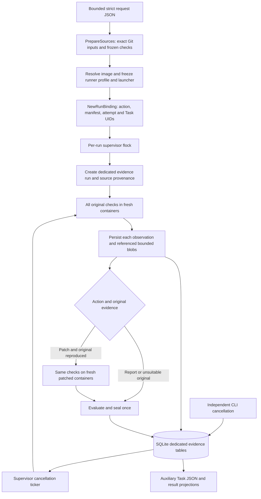

# Report Validation and Patch Verification: Local POC and Delivery Plan

## Recommendation

Implement the updated [issue #542](https://github.com/orka-agents/orka/issues/542)
as two actions sharing one evidence-owned workflow, not an extension that relaxes the monitor-only
`run_validation` authorization. Reuse Tasks for scheduling and familiar result
projections, but never use Task phase, agent prose, or replaceable artifacts as
the authority for a patch conclusion.

`validate-report` answers whether the report reproduces on the original version
and finishes without a patch. `verify-patch` runs the original checks again and,
only after all required original behavior is established, compares the patch.
Neither action requires an Orka scan or Orka-authored patch. A linked earlier
validation supplies frozen checks and context, never observations for the new run.

Freeze independent checks before execution and require problem-specific outcomes.
Unknown outcomes fail closed. This POC demonstrates both actions, immutable linked
evidence, configuration lifecycle scenarios, and two confinement profiles; it is
not a completed production controller implementation.

## Status and scope

The local-Docker design below remains the standalone POC contract. An opt-in
Kubernetes backend now adds actual Task/Job dispatch with a separate supervised
worker for standard Linux nodes. See
[Kubernetes and AKS operation](../../website/docs/operations/patch-verification.md)
for deployment prerequisites, authorization, lifecycle and validation commands.
This does not add support for full cluster environments *under test*.

Report validation runs operator-selected checks on one frozen original version.
Patch verification compares that original with a frozen patch or patched commit.
Both record explicit healthy/failure observations, tested scope, and gaps. They
never change source repositories, publish branches, open PRs, modify production
resources, or automatically retry failed attempts.

The execution backend is **local-docker**. The CLI creates one Orka `Task` object
for report validation or two for patch verification as local execution identities,
and saves their JSON and summary results
through the existing SQLite artifact/result APIs. They are **not Kubernetes CRs**,
are not submitted to an API server, and are not reconciled into Jobs. Generic Task
commands deliberately contain `exit 125`; exporting and submitting these objects
must not accidentally bypass the verification sandbox.

The CLI, source preparation, Docker observer, adjudicator, and dedicated SQLite
store are integrated. The default command uses real source preparation:

```go
func PrepareSources(context.Context, Request) (*PreparedSources, error)
func (*PreparedSources) Close() error
```

There is no mock-success CLI mode or fallback to a live checkout. The updated
Go, C, HTTP, and managed-configuration examples completed 58 real CLI scenarios,
including report reproduction/non-reproduction, unsupported environments, direct
patch comparisons, and linked patch runs. Earlier patch-only evidence remains
inspectable and is not reinterpreted as an updated-action result.

Only local Git repositories and full SHA-1/SHA-256 commit identities are accepted.
Remote acquisition, PR URL resolution, private-repository credentials and
automatic check generation remain follow-up work. Kubernetes dispatch is a
separate opt-in backend; the local CLI described here still runs Docker.

## User semantics

Every invocation of `start`, including identical input, creates a fresh random
attempt ID and one or two random UUID Task UIDs. `NewRunBinding` binds them to the frozen
manifest digest. Editing checks, setup, image, problem description, input, or
patch produces a new run. There is no best-attempt selection or silent reuse.

The first JSON line from `start` contains `action`, `reportDigest`, `runID`, `attemptID`,
`executionBackend: local-docker`, and running progress. It is emitted immediately
after provenance creation, before any check. The second line is the final compact
summary. Preparation errors emit a failed/Unable summary without an invented run
ID: a run cannot exist before its source identities are known.

`jobStatus` describes orchestration, independently from `overall.conclusion`:

| Report-validation conclusion | Meaning within the declared scope |
| --- | --- |
| Reproduced | Required checks ran; the listed cases demonstrated the reported behavior |
| Not reproduced under these conditions | Required checks ran with suitable setup but no reported case reproduced; this does not prove the report is wrong |
| Unable to validate | Required evidence is missing, conflicting, or unusable, or the environment is unsupported |

| Conclusion | Meaning within the declared scope |
| --- | --- |
| Verified for these checks | Original reproduces every declared problem; patched checks are healthy; normal cases remain healthy |
| Not fixed | Patched reproduction checks still exhibit the declared failure |
| Partially fixed | Some reproduced problems are repaired and others remain |
| Introduces a regression | A previously healthy required normal case breaks |
| Unable to verify | Missing, ambiguous, interrupted, rejected, corrupt, timed-out, truncated, or unusable evidence |

A completed job can conclude Not fixed, Partially fixed, Regression, or Unable.
A running job has no favorable conclusion. Inspect the effective assessment,
never just a historical seal or a Task phase. Conflicts or integrity failures can invalidate a
previously completed favorable result without rewriting its immutable seal.
Cancellation after healthy finalization is idempotent and leaves the result unchanged.

Report `start` exits 0 for finalized Reproduced or Not reproduced results, and 2
for Unable or operation errors. Patch `start` exits 0 for Verified, 1 for
Not fixed/Partially fixed/Regression, and 2 for Unable or operation errors.
Read/control commands exit 0 on a successful operation and 2 on failure.
`go run` itself reports a child's nonzero exit and may return 1; build the binary
under `bin/` when exact process exit codes are needed.

## Architecture and flow



1. Parse at most 1 MiB of UTF-8 JSON. Reject unknown and duplicate fields,
   trailing values, symbolic commits, ambiguous patch inputs, and remote paths.
   Relative paths resolve against the canonical request file directory, not CWD.
2. Prepare clean original/patched snapshots outside worktrees. Freeze complete
   checks/setup inventories and exact source archive/tree/diff/patch identities.
   The source preparer owns archive limits, traversal/link rejection, Git isolation,
   private staging, and cleanup. No client-supplied hash substitutes for preparation.
3. Inspect a preinstalled digest-pinned native Linux image. Apply variables,
   dependencies, profile, and fixtures, then `DockerRunner.FreezeEnvironment`.
   This binds the runner policy version, exact seccomp bytes, and trusted static
   launcher digest for local-services. Deep-copy and validate the entire manifest.
4. Mint identities, acquire the per-run lock, and create dedicated evidence tables
   with existing `sqlite.NewDB`/`NewStore`. Persist every source provenance blob
   under the exact trusted binding before executing checks.
5. Run every original check and persist observations immediately. Reports finish
  here. For verification, require every original reproduction and normal check
  before starting the patched arm; otherwise finalize Unable with patched slots
  untested. Unsupported requirements finalize an appropriate Unable record with
  named missing requirements and no workloads. No failure selects a retry.
6. Join the cancellation watcher and clean prepared inputs before sealing.
   Cleanup/operation failures cannot produce a favorable result. Persist auxiliary
   Task/result projections, which may be stale and never override evidence.

## Invariants

- Same checks, setup, image/platform, profile, and declared services on both
  sides; only the frozen source arm differs.
- Every required original check is attempted unless cancellation or an integrity
  failure stops the run. Patch checks execute only after a suitable original run.
- Reproduced, not-reproduced, and untested report cases remain separate. Missing
  required evidence prevents a conclusive overall result. A patch's unfixed and
  regression cases remain individually visible even when regression takes precedence.
- Rejected or conflicting observation slots are untested in the current assessment;
  unaffected cases remain available. Incomplete seals freeze their excluded-slot
  set, so a later incident cannot rewrite the historical result. Older seals keep
  their exact bytes and remain inspectable.
- Failed/skipped/timed-out/truncated attempts are not overwritten with successes.
- Binding is minted by trusted local orchestration, never accepted from subject
  output. stdout text such as `tests passed` is not an attestation of execution.
- All retained blobs are referenced and digest checked. Output defaults to 64 KiB
  per stream. Rejected raw bytes are not copied into auxiliary Task artifacts.
- Credential-looking output is rejected, not redacted into passing evidence.
  Generic setup diagnostics avoid exposing source/runner error strings.
- Evidence tables, seals, and blobs have no Task cleanup foreign key. Removing
  auxiliary Task results/artifacts does not delete or restore authoritative data.
- DB and locks stay outside prepared source/check trees; no controller/API edits.

## Linking a later patch

`earlierValidation` accepts an intact, finalized report-validation run in the
same private database. The CLI restores its report, original version, check
files (including executable modes), and setup. Explicit overrides must match.
Access is checked through the same private, owned database path; the lookup is
read-only, including failures. Cross-database IDs, invalidated records, wrong
actions, and incomplete records cannot provide linked evidence.

The new manifest records the earlier run ID, report digest, manifest digest, and
seal digest. The original is executed again with new Task/attempt IDs, even if
the prior report reproduced. The earlier evidence, seal, conclusion, and auxiliary
Task records remain unchanged. No observations are copied to the new run.

This is local file-based authorization, not multi-tenant authorization. Product
API integration must enforce caller access to the report, run, and every linked
evidence object. A reproduction-only report cannot supply missing normal-use
checks: prepare a new direct run with a complete check set instead.

## Change and environment declarations

New requests state `action`. Explicit `verify-patch` requests also require
`declaredChanges`, with kind `source`, `dependency`, `deployment`, `configuration`,
or `permission`, a description, and optional safe repository-relative paths.
These are recorded declarations, not an automatic audit that the diff is complete.
Legacy requests without an action remain usable as verification; their inferred
source declaration is explicitly marked as legacy. Historical JSON hashes and
blank-action conclusions remain unchanged.

`requiredEnvironment` is frozen into `environment.requirements`. Only `process`
and configured `local-services` are supported. A local-service requirement's name
must match its frozen fixture ID; an unrelated service cannot satisfy it. `cluster`, `controller`,
`external-service`, and `test-identity` requirements finalize Unable to validate
or Unable to verify with the missing requirement named, without widening network
access or running a local substitute. Full cluster/external-service implementations
are follow-up work, as specified by the updated issue.

Missing requirements are listed once in the overall reason, with bounded per-case
references. The maximum accepted 100 checks and 32 environment requirements still
produce a finalized Unable record within the evidence seal's size limit.

Each check can record an ordered `lifecycle` containing install, reconcile,
restart, and upgrade. Labels alone prove nothing: a frozen scenario driver runs
the sequence within one disposable check environment and its captured state and
service effects must match the frozen expectations. Different checks share no
writable state. Changed checks/setup require a new run of every applicable version.

### Managed configuration example

The `config` fixture changes policy data, not the manager implementation. A
modeled managing process installs/reapplies the policy, restarts against retained
data, or updates an affected installation. The trusted scenario records effective
anonymous access and retained state; a separate HTTP service records requests.
The exact installed source tree and tool image identities are runner observations.
State printed by the scenario remains driver-reported, not independent attestation.

The fixed patch protects anonymous access, keeps authenticated use working, and
migrates existing state. The partial patch fixes fresh installs but leaves an
affected upgrade exposed. The temporary patch changes effective state only at
installation; reconciliation/restart undo it. Both remain Partially fixed with
their failing lifecycle cases listed, never Verified. The model explicitly
declares a process environment and a gap for real controllers/clusters; requiring
an actual controller produces Unable instead.

## Cancellation, restart, and retention

`cancel` opens its own database handle and derives binding from the stored run.
The store serializes cancellation and finalization across processes. A 500 ms
supervisor ticker reads state; any closed state stops the runner context. SIGINT,
SIGTERM, and the whole-run deadline also stop execution. The runner owns bounded
termination/drain/removal of the subject, fixtures, and namespace anchor. Cleanup
continues with a separate bounded context after the execution context is cancelled.

Cancellation of a running record is durable, not an assertion that cleanup has already finished.
The cancelling CLI can return before the supervisor completes cleanup. The store
does not accept new observation slots after cancellation, so an in-flight return
that loses that race is not appended; the cancellation incident and missing slot
remain Unable. Prior accepted evidence remains inspectable. No partial attempt is
reused in a later run.

`recover` must acquire the same nonblocking per-run `flock`. A PID in a file is
diagnostic only; lock ownership is the authority. Recovery never resumes. An
orphan running record becomes interrupted/Unable, and finalized records remain
unchanged. Merely opening the DB does not recover or invalidate any live run.

The current runner labels containers with a per-check owner, not the durable run
ID. Therefore recovery conservatively refuses while **any** container with the
runner owner label exists, including stopped containers, or Docker cannot be
inspected. It does not delete other runs' resources. Following a supervisor
SIGKILL, inspect owner-labelled containers and remove only independently confirmed
orphans, then recover. This may block recovery while an unrelated verification
runs. Durable per-run container inventory and exact fenced reaping are production
work; PID lock loss alone does not prove Docker workloads stopped. Staged temporary
files may also require manual cleanup after SIGKILL.

Use a private, local filesystem and the same canonical absolute database pathname
in every CLI process. Do not rename, hardlink, replace, or delete DB/lock paths
while active. Lock files are intentionally not unlinked at release. Network
filesystems, multi-host supervisors, hostile same-UID processes, and administrator
tampering are outside this local authority model.

Keep the DB outside disposable fixture directories. Back up SQLite consistently
with its WAL; do not copy only the live database file. The POC provides bounded
per-run storage but no automatic retention, quota across runs, encryption, or GC.
Stop supervisors and perform an explicit backup before manual database retirement.
Never base retention on auxiliary Task cleanup.

## Threat model and limitations

Trust the operator-selected checks, tool image, launcher build, host kernel, local
Docker Unix socket, local CLI binary, and DB owner. The project is untrusted inside
the runner sandbox. No credentials, publication tokens, Docker socket, host network,
host PID namespace, or writable source mounts enter workload containers. Offline
checks lack Internet sockets. Local-services adds only declared loopback TCP ports
with a trusted native static Landlock launcher, no external DNS or egress. The v3
profile uses socket activation: before executing each fixture, the launcher binds
one dual-stack IPv6 TCP listener on its declared port and passes `ORKA_LISTEN_FD=3`.
Fixtures adopt and own that descriptor instead of calling bind/listen. Subjects
and the namespace anchor receive no listening descriptor. An inherited seccomp BPF
filter denies all later bind/listen calls in every role, including implicit
ephemeral listeners. Fast Open flags on sendto/sendmsg/sendmmsg and datagram Unix
socketpairs are denied. Only private stream socketpairs remain in local-services.
Offline Go/C restrictions are unchanged.

Kernel support and policy enforcement must succeed; a launcher digest mismatch or
missing confinement is Unable, never permission to fall back. Dependency metadata
is a declared inventory, not an SBOM or proof of arbitrary dependency installation.
Install tools into the pinned image in advance; builds cannot download packages.
Local fixtures require native IPv6 dual-stack loopback support and permission to
install inherited BPF via `prctl` with no-new-privileges. Multi-port fixture
activation, fixture outbound ports, and unavailable IPv6 are rejected. Re-exec
cannot widen the filter or regain a listening descriptor. Fixtures close/drain
the adopted socket and exit zero on SIGTERM; no extra capabilities or firewall
installation are needed.

The runner policy identity is `local-docker-v3-socket-activation`. New executions
need rebuilt trusted launcher bytes and newly frozen manifests. Historical records
retain their original profile and seals; do not reinterpret v2 results as v3 evidence.

Project-controlled stdout and exit codes are reproduction observations, not proof
of semantic correctness or that a claimed test suite was actually executed. Choose
checks independently; prefer independently observed fixture effects when relevant.
Even that proves only those effects. Finite checks cannot establish absence of all
regressions, equivalence for every input, nondeterminism, or production readiness.
Known plaintext credential detection is not a complete secret scanner, especially
for arbitrary binary/compressed content. Only credential-free sources are allowed.
Hashes detect corruption; an administrator can rewrite both data and hashes.

### Resource and source boundaries

Source preparation requires native Linux, Git, and executable util-linux
`/usr/bin/prlimit`. Every Git subprocess has a 512 MiB address-space limit,
15-second CPU/wall limits, disabled core dumps, and a sanitized environment.
Commit/tree objects are bounded and hash-verified before private traversal.
No repository hooks, filters, replacements, alternate stores, credentials, or
publication configuration are imported.

Source tar/diff/patch blobs are limited to 32 MiB each, aggregate provenance to
128 MiB, tree traversal to 8,192 entries, and frozen checks to 128 files within
a 1 MiB manifest. Patch accounting includes intermediate text/binary growth.
Symlinks, submodules, special files, unsafe paths, and patches exceeding these
conservative limits are rejected. These limits intentionally exclude some large
projects from the POC; do not bypass them to obtain a favorable result.

Every frozen file records its actual executable bit, including helper scripts.
Inventory validation rejects mode changes; restaging uses `0555` or `0444` from
frozen metadata. The bit participates in the manifest digest, while omitted false
preserves historical JSON hashes. Executable metadata and file contents do not
establish independent check authority or turn project test prose into attestation.

## Reproduction

From the isolated POC checkout:

```sh
go test ./internal/patchverification/local
go test ./cmd/patchverify
mkdir -p bin
go build -o bin/patchverify ./cmd/patchverify
```

Prepare a disposable fixture repository and exact-commit request. The demo script
prints the generated request pathname and commits only in a fresh temporary repo:

```sh
request=$(bash examples/patch-verification/demo.sh go fixed)
db_dir=$(mktemp -d /tmp/patchverify-evidence.XXXXXX)
db="$db_dir/evidence.db"
go run ./cmd/patchverify start --request "$request" --db "$db" | tee "$db_dir/start.jsonl"
```

To validate a report without a supplied patch:

```sh
report=$(bash examples/patch-verification/demo.sh go fixed patch validate-report)
bin/patchverify start --request "$report" --db "$db" | tee "$db_dir/report.jsonl"
```

When a patch arrives, reference the completed report and use the same private DB:

```sh
earlier=$(jq -r 'select(.jobStatus == "completed") | .runID' "$db_dir/report.jsonl")
jq -n --arg earlier "$earlier" --arg patch "$PWD/examples/patch-verification/go/fixed.patch" '
  {action:"verify-patch", earlierValidation:$earlier, patchFile:$patch,
   declaredChanges:[{kind:"source", paths:["order.go"], description:"Reject out-of-range quantities"}]}
' > "$db_dir/linked.json"
bin/patchverify start --request "$db_dir/linked.json" --db "$db"
```

After that run, inspect its exact recorded ID and one captured blob:

```sh
run=$(jq -r 'select(.runID != null) | .runID' "$db_dir/start.jsonl" | head -n 1)
go run ./cmd/patchverify get --db "$db" --run "$run"
go run ./cmd/patchverify evidence --db "$db" --run "$run"
digest=$(go run ./cmd/patchverify evidence --db "$db" --run "$run" | jq -r '.record.evidence[0].observation.stdoutDigest')
go run ./cmd/patchverify evidence --db "$db" --run "$run" --digest "$digest"
go run ./cmd/patchverify cancel --db "$db" --run "$run"
go run ./cmd/patchverify recover --db "$db" --run "$run"
```

For cancellation during execution, use the same absolute `db` path and early
`runID` in another terminal while the foreground supervisor is running. `get`
works before completion; `recover` must refuse while the owner lock is held.

`evidence --digest` emits a bounded base64 JSON envelope. `--raw` emits exact bytes
and can include terminal control sequences; use only for trusted captures. Oversized
blobs are refused instead of silently truncated; full provenance sizes/hashes are
available in evidence JSON. HTTP demo prerequisites and launcher compilation are
documented in the example README. Run all variants through the identical workflow;
changing the request creates another independent run.

Run the complete reproducible matrix after building the trusted HTTP launcher
as described in [the example README](../../examples/patch-verification/README.md):

```sh
matrix=$(mktemp -d /tmp/patchverify-matrix.XXXXXX)
bash examples/patch-verification/verify.sh go "$matrix"
bash examples/patch-verification/verify.sh c "$matrix"
bash examples/patch-verification/verify.sh http "$matrix"
bash examples/patch-verification/verify.sh config "$matrix"
bash examples/patch-verification/validate.sh go "$matrix"
bash examples/patch-verification/validate.sh c "$matrix"
bash examples/patch-verification/validate.sh http "$matrix"
bash examples/patch-verification/validate.sh config "$matrix"
```

The harness asserts process exit codes, all required observations, exact source
and attempt identities, immutable seals, and evidence retrieval from reopened
databases. It retains databases, JSON summaries, captures, and request paths.

## Staged production delivery

### 1. Establish the local protocol

Completed in this POC: standalone report validation, fresh paired patch runs,
authorized local linking, shared evidence, confined local-service and configuration
lifecycle examples, unsupported-environment results, bounded hostile inputs,
and local cancellation/recovery tests. Retain these as the protocol conformance
suite for the production backend. Native arm64 and crash recovery with an exact
durable workload inventory still require dedicated validation.

### 2. Versioned product API and authority

Define immutable request/run/attempt resources and user-facing progress independent
of conclusion. Enforce tenant/namespace ownership on start/get/evidence/cancel and
recovery. Bind Task UID, attempt, source, manifest, policy version, and operation
capability to authenticated supervisor identities. Do not expose local store
methods as unauthenticated network endpoints. Bound API bodies and blob inspection;
do not accept arbitrary client-supplied observations or hashes as authority.

Provide `POST /validations` with either action, `GET /validations/{id}`,
`GET /validations/{id}/evidence`, and `POST /validations/{id}/cancel` under the
existing authenticated API. Apply access checks to earlier-validation links.
Resolve PR links to full commits before creating a run. Keep read credentials in
the acquisition component, never the tested program. Prefer a dedicated stored
record over a new CRD unless reconciliation requires Kubernetes-native ownership.

### 3. Real Orka Task and Job execution

Create original-only or original/patched Task CRs through the existing authenticated API/controller
flow with actual Kubernetes UIDs, read-only intent, no credentials/publication,
one attempt, and digest-pinned tool images. Add a dedicated trusted verification
worker protocol and explicit sandbox policy rendering; generic worker commands
are not equivalent to this runner. Persist dispatch ownership before execution.
Only an authenticated, operation-bound supervisor can submit observations. Do not
mount the evidence DB or its credentials into subject/fixture containers. Validate
restricted PodSecurity, network enforcement, service-role isolation, and resource
limits in a real cluster before enabling this backend.

### 4. Durable supervision and cleanup

Add epoch-fenced leases and durable workload UID inventories. Cancellation revokes
result authority first, then terminates exact Jobs/Pods/fixtures and records cleanup
completion separately. On restart, reconcile inventory and deadlines without
rerunning checks or selecting prior favorable data. Test stale workers, API outage,
lost acknowledgements, leader changes, duplicate evidence, and concurrent cancel
versus finalize. Local `flock` is not a distributed lease.

### 5. Store, retention, and compatibility

Promote dedicated tables through reviewed schema migrations and API versioning.
Add tenant quotas, bounded pagination, consistent backups, audited retention,
legal holds if required, encryption controls, and reference-aware GC. Retain
manifest/binding/provenance/evidence integrity independently of Task TTL. Preserve
historical seals and expose effective invalidation. Version runner policy and
observation protocols; reject incompatible workers. Document upgrade/downgrade
and rollback, including runs frozen under earlier policies.

### 6. Release gates and observability

Keep production dispatch opt-in until compatibility, security, auth, cleanup, and
native-platform suites pass. Add bounded counters for conclusions, failures,
rejections, cancellation latency, cleanup failures, and storage limits. Do not put
raw captures, source paths, problem text, or run IDs into unbounded metric labels.
Review trusted-check selection and clearly display tested scope and known gaps.
Canary with kill/restart experiments and exercise disabling new submissions while
existing runs drain or cancel; preserve reads and evidence across rollback.

## Acceptance checklist

- [x] Strict bounded request parsing and request-relative path resolution.
- [x] Patch-free report validation finalizes evidence and reusable checks.
- [x] Direct and linked verification run the original again before the patched arm.
- [x] Earlier evidence is unchanged even after its live check directory is removed.
- [x] Fresh attempts and action-specific UUID-backed Task object projections.
- [x] Three report conclusions and five patch conclusions with per-case outcomes.
- [x] Declared source/configuration/dependency/deployment/permission metadata.
- [x] Unsupported cluster/controller/identity/service requirements fail closed.
- [x] Managed configuration, temporary overrides, restart, and retained-state upgrade examples.
- [x] Separate job status and effective conclusion; auxiliary cleanup independence.
- [x] Cancellation before/during/after completion and DB reopen in focused tests.
- [x] Live-owner recovery refusal and explicit quiescence prerequisite in tests.
- [x] Failed-attempt collection and credential/unreferenced output rejection tests.
- [x] CLI command handlers testable without faking the real default source path.
- [x] Independent CLI-process cancellation and live-owner recovery exclusion.
- [x] Baseline v2: all 24 Go/C/HTTP patch and commit comparisons, with 144 observations.
- [x] Cleanup failure prevents favorable sealing; caller inputs are deep-frozen.
- [x] Real PrepareSources/Close integrated with the default CLI.
- [x] Offline Internet socket denial and declared-port-only local TCP services.
- [x] External IPv4/IPv6/DNS, undeclared ports, and fixture spoofing tests.
- [x] Both-role implicit-listen, Fast Open, datagram socketpair, and helper-mode regressions.
- [x] Socket-activated dual-stack fixtures, descriptor clearing, and fail-closed prerequisites.
- [x] Git subprocess resource limits and intermediate patch-growth regression tests.
- [x] Repeat the 24-case matrix with freshly frozen v3 manifests and rebuilt binaries.
- [x] Fragmented HTTP requests and fresh post-shutdown anchor inspection deadlines.
- [ ] Native arm64, real CLI SIGKILL orphan reaping, and distributed restart recovery.
- [ ] Remote/PR inputs, production linked-evidence access checks, and managed check preparation.
- [ ] Full cluster and external-service execution (explicit follow-up, no modeled coverage claim).
- [ ] Real Task CRs, Jobs, controller/API authentication and operation capabilities.
- [ ] Distributed fencing, exact orphan reaping, retention, quotas, and safe rollout.

## Verification results

The two-action alignment completed 58 live scenarios with 328 accepted execution
observations: Go/C/HTTP each ran eight direct comparisons and six report/link
cases; configuration ran ten comparisons (including temporary overrides) and six
report/link cases. Unsupported cases intentionally created no workloads. Both
linked input modes restored saved checks after their old directory was moved and
asserted the complete earlier evidence response remained byte-identical.

Retained alignment evidence:

- Go: `/tmp/orka-542-aligned-go.l0LqBD`
- C: `/tmp/orka-542-aligned-c.a0UgFD`
- HTTP: `/tmp/orka-542-aligned-http.eVLzxC`
- Configuration: `/tmp/orka-542-aligned-config.ebyeFk`

The earlier patch-only results below remain separate historical evidence.

The v3 local CLI matrix passed on native `linux/amd64`: Go, C, and HTTP each
produced Verified, Not fixed, Partially fixed, and Regression with both input
modes. All 24 runs retained six observations and evidence was reread after
source-workspace cleanup. The v3 matrix is retained at
`/tmp/orka-542-v3-matrix.9Hbveq` on the development machine. Earlier v2 evidence
remains separate at `/tmp/orka-542-matrix-8fa91a57`.

Focused unit/race tests cover Unable outcomes, missing tools/checks, timeouts,
blocked networking, duplicate/conflicting writes, wrong attempts, corruption,
cancellation ordering, reopening the store, and local supervisor recovery locks.
Live confinement tests cover fixture reachability and output authority, declared
TCP ports, external network denial, truncation, cancellation, and cleanup.
The final `make lint-fix` reports zero issues. The complete verification package
passes with `ORKA_PATCH_VERIFY_DOCKER_TEST=1 go test -race
./internal/patchverification -count=1`, including the v3 live tests and the final
fragmented-request and shutdown-deadline regressions. Local supervisor and CLI
race suites, focused immutable-store compatibility tests, and the earlier full
SQLite race run also passed. Retained evidence is never rewritten after code
changes; changing the fixture or runner requires a new run.

`make test` ran generation, formatting, vet, and the repository test suite.
The POC, controller, API, and store packages passed. The gate is not fully green:
`internal/tools/TestCodeExecTool_Execute_Node` fails with empty output instead of
`node-test`. The same test fails with unchanged code and dependencies at base
`55cb3d5232b4a9b697e72471e346c0a6493d4c21`; no unrelated tool fix is included.

Regression coverage includes corrupt stored bindings, lossy UTF-8 manifests,
incomplete output identities, undeclared network access, Git object decompression
limits, intermediate patch growth, and frozen helper modes. Unsafe network
syscalls were reproduced in isolated network-none containers before the correction
and denied afterward. These checks remain scoped to the local trust model, not
production readiness.

VS Code's language service does not include this isolated worktree in its module
list. Direct Go commands are the compile/test authority; workspace settings and
other repositories were not edited to suppress editor diagnostics.

## Implementation map

| Surface | Implementation |
| --- | --- |
| CLI operations | `cmd/patchverify/` |
| Strict requests, local lifecycle, auxiliary Tasks | `internal/patchverification/local/` |
| Exact source and frozen check preparation | `internal/patchverification/source*.go` |
| Evidence model and conclusions | `internal/patchverification/evaluate.go`, `record.go` |
| Container observer and profiles | `internal/patchverification/docker*.go`, `launcher/landlock.c` |
| Immutable records, blobs, seals, incidents | `internal/store/sqlite/patch_verification*.go` |
| Reproducible fixtures and matrix | `examples/patch-verification/` |
